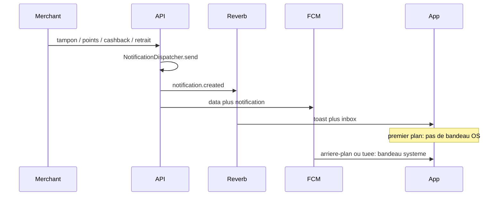

# Notifications par transaction fidélité

Choix validé : si un tampon/achat débloque aussi une récompense, le client reçoit **les deux** (opération + `reward_unlocked`).

## Constat

- [`NotificationDispatcher::send`](restaurant-loyalty-api/app/Services/NotificationDispatcher.php) crée déjà la ligne `notifications` + événement Reverb `notification.created` + FCM.
- Le **cashback crédit** et `level_up` existent déjà dans [`grantCashback`](restaurant-loyalty-api/app/Http/Controllers/Api/MerchantDashboardController.php). **Tampons / achats (points) / retrait / utilisation cashback** ne créent aucune notif d’opération (seulement `reward_unlocked` si un palier est franchi).
- Côté Flutter, [`NotificationsNotifier`](Miva_Fid/lib/features/client/providers/app_providers.dart) recharge la liste sur `onNotificationCreated` **sans toast**. [`NotificationService._handleForegroundMessage`](Miva_Fid/lib/core/services/notification_service.dart) affiche un **bandeau OS** même app ouverte — à l’inverse de ce que tu veux.
- `PresenceChecker` interroge `presence-customer.{id}` ; l’app ne s’y abonne pas (`private-loyalty.{id}`). On ne s’appuie pas dessus : **FCM toujours envoyé**, affichage OS seulement hors premier plan (pattern FCM standard).

## Types et copies (sans emoji — règle UI)

Tous `PUSH_ENABLED_TYPES => true`, `data.card_id` (le résolveur Flutter ouvre déjà la carte pour tout type avec `card_id`).

| type | déclencheur | titre / corps (FR) |
|---|---|---|
| `stamp_added` | `grantStampOrPoints` programme tampon | Tampon ajouté / +1 tampon chez {commerce} |
| `points_added` | idem, type `spend` | Points ajoutés / +{n} point(s) chez {commerce} |
| `stamp_removed` | `removeStamp` (tampon) | Tampon retiré / Un tampon a été retiré chez {commerce} |
| `points_removed` | `removeStamp` (spend) | Points retirés / {n} point(s) retirés chez {commerce} |
| `cashback_received` | déjà là | garder le texte, **retirer l’emoji** du titre |
| `cashback_redeemed` | `redeemCashback` après succès | Cashback utilisé / {n} FCFA utilisés chez {commerce} |

`reward_unlocked` / `level_up` inchangés en déclenchement. Deux toasts d’affilée si récompense en même temps : file d’attente dans `ToastService` (aujourd’hui `hideCurrent` écrase le premier).

Hors périmètre : pas d’annulation cashback (aucun endpoint). Destinataire = **client** de la carte, pas le marchand.

## Backend

[`MerchantDashboardController`](restaurant-loyalty-api/app/Http/Controllers/Api/MerchantDashboardController.php) : `send()` **après** le commit (comme le cashback actuel).

- `grantStampOrPoints` : après `LoyaltyCardUpdated`, envoyer `stamp_added` ou `points_added` (`value` = `$earned`), puis les `reward_unlocked` existants.
- `removeStamp` : après succès, recharger la carte, `stamp_removed` / `points_removed` selon `loyaltyProgram.type` (`abs` de la valeur de la reversal).
- `redeemCashback` : `cashback_redeemed` avec le montant débité.
- [`PUSH_ENABLED_TYPES`](restaurant-loyalty-api/app/Services/NotificationDispatcher.php) : ajouter les 5 types (dont `cashback_received` déjà présent).

Tests (TDD, même style que [`CashbackNotificationTest`](restaurant-loyalty-api/tests/Feature/Merchant/CashbackNotificationTest.php)) :

- `tests/Feature/Merchant/TransactionNotificationTest.php` : tampon, points, retrait tampon, retrait points, redeem cashback, et **tampon qui débloque** = 1 `stamp_added` + 1 `reward_unlocked`.
- Étendre [`AddStampTest`](restaurant-loyalty-api/tests/Feature/Merchant/AddStampTest.php) / [`RemoveStampTest`](restaurant-loyalty-api/tests/Feature/Merchant/RemoveStampTest.php) seulement si plus simple que le fichier dédié.

## Flutter

1. **Toast sur Reverb** — dans `NotificationsNotifier`, le listener `onNotificationCreated` utilise le payload (`title`/`body`) : `ToastService.showSuccess` (gains) ou `showWarning` (retraits / redeem), puis `load()` comme aujourd’hui. Marchand : pas de toast (ses types restent informatifs).

2. **File de toasts** — [`ToastService`](Miva_Fid/lib/core/utils/toast_service.dart) : file FIFO, le suivant s’affiche à la fin du timer / au dismiss. Évite de perdre `reward_unlocked` derrière `stamp_added`.

3. **Pas de bandeau OS au premier plan** — `_handleForegroundMessage` : ne plus appeler `show` local. Le toast Reverb suffit ; si Reverb est coupé, un toast depuis FCM `onMessage` en repli, dédupliqué par `id` de notif (ajouter `notification_id` dans le data FCM de `pushToRecipient`).

4. **Inbox** — icônes dans [`notifications_screen.dart`](Miva_Fid/lib/features/client/notifications/notifications_screen.dart) : tampon/points (`LucideIcons.stamp` / `coins`), cashback (`wallet`), retrait (`undo-2`).

5. Tests : étendre le listener (fake stream + `ToastService` / overlay) ; test widget file de toasts si raisonnable.

## Vérification

- `php artisan test --filter=TransactionNotification` et `CashbackNotificationTest`
- `flutter test` sur notifs / toast
- Manuel : app ouverte → toast + cloche, pas de notif système ; app tuée → push OS ; clic → carte (déjà `CardDestination`)
